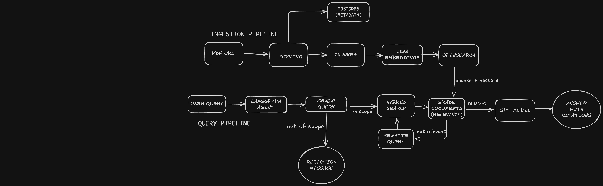

# GermanDocAI

Production RAG system for German regulatory document intelligence.

Answers questions about BaFin publications, EU AI Act, and DSGVO
using hybrid search and an agentic reasoning layer built with
DSGVO compliant architecture and deployed on Azure.

## What This Does

- Ingest and parse German regulatory PDFs (BaFin, EU AI Act, DSGVO, Bundesbank)
- Hybrid search combining BM25 keyword and semantic similarity
- LangGraph agent with guardrail, document grading, query rewriting
- DSGVO compliance layer with audit logging on every query
- Persistent chat history with session management
- DSGVO Right to erasure with complete user data deletion across PostgreSQL and OpenSearch
- Deployed on Azure Container Apps (West Europe region)

## Architecture



## Tech Stack

| Layer | Technology |
|---|---|
| Language | Python 3.11 |
| API | FastAPI |
| Document Parsing | Docling |
| Search | OpenSearch (hybrid BM25 + semantic) |
| Agent | LangGraph |
| Deployment | Azure Container Apps |
| Observability | Langfuse (planned) |
| Evaluation | RAGAS (planned) |

## API Endpoints

| Method | Endpoint | Auth | Description |
|---|---|---|---|
| GET | /health | No | Service health check |
| POST | /documents/ | Yes | Store a document |
| GET | /documents/{doc_id} | Yes | Retrieve a document |
| POST | /ingest/ | Yes | Ingest PDF from URL |
| POST | /ask/ | Yes | Hybrid search query with audit logging |
| POST | /ask/agent | Yes | LangGraph agentic reasoning with audit logging |
| GET | /compliance/audit/{user_id} | Yes | DSGVO audit trail for user |
| GET | /compliance/sessions/{user_id} | Yes | Chat sessions for user |
| GET | /compliance/sessions/{session_id}/messages | Yes | Messages in a session |
| DELETE | /compliance/users/{user_id} | Yes | Erase all user data — DSGVO Article 17 |


All protected endpoints require `X-Api-Key` header.

## Prerequisites 

- Docker Desktop 
- Python 3.11+ 
- uv
- Azure OpenAI account with GPT-4o deployment
- Jina AI account (free tier)

 
Install uv
```bash
pip install uv
```

## Development Setup
```bash
git clone https://github.com/harish2f/german-doc-ai
cd german-doc-ai
cp .env.example .env # copy .env.example to .env to fill in keys
uv sync
```


Required keys in .env:
- AZURE_OPENAI_API_KEY — from Azure portal -> Keys and Endpoint
- AZURE_OPENAI_ENDPOINT — format: https://your-resource.openai.azure.com/
- AZURE_OPENAI_DEPLOYMENT — your GPT model deployment name
- JINA_API_KEY — from jina.ai (free tier)


Start the databases:
```bash
docker-compose up -d
```

Start the API:
```bash
uv run uvicorn src.main:app --reload
```

Swagger UI

> Open http://localhost:8000/docs to explore the API interactively.


Run tests:
```bash
uv run pytest tests/ -v
```

Ingest a document:
```bash
curl -X POST http://localhost:8000/ingest/ \
  -H "x-api-key: dev-secret-key" \
  -H "Content-Type: application/json" \
  -d '{"url": "https://arxiv.org/pdf/2303.08774", "title": "GPT-4 Report", "doc_type": "other"}'
```

Ask a question:
```bash
curl -X POST http://localhost:8000/ask/ \
  -H "x-api-key: dev-secret-key" \
  -H "Content-Type: application/json" \
  -d '{"query": "What are the safety evaluations?", "doc_types": [], "top_k": 5}'
```

Ask using the LangGraph agent (multi-step reasoning):
```bash
curl -X POST http://localhost:8000/ask/agent \
  -H "x-api-key: dev-secret-key" \
  -H "Content-Type: application/json" \
  -d '{"query": "What are BaFin requirements for MiCAR regulation?", "doc_types": ["bafin"], "top_k": 5}'
```

Check audit trail for a user:
```bash
curl -X GET http://localhost:8000/compliance/audit/Harish \
  -H "x-api-key: dev-secret-key"
```

Erase all user data (DSGVO Article 17):
```bash
curl -X DELETE http://localhost:8000/compliance/users/Harish \
  -H "x-api-key: dev-secret-key"
```


The agent automatically grades retrieved documents, rewrites the query if needed, and retries retrieval before generating an answer.


## Build Log

Weekly progress tracked in [docs/build_log.md](docs/build_log.md)